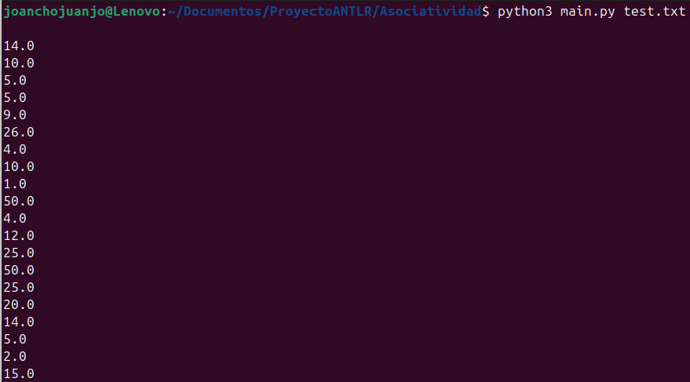
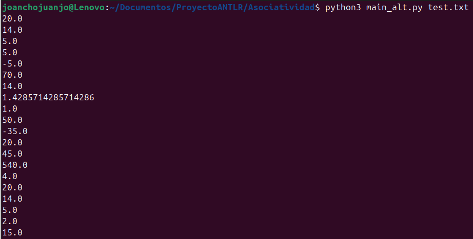

## Pruebas-de-precedencia-y-Asociatividad

Este proyecto muestra cómo cambia el resultado de las expresiones aritméticas cuando se modifica la gramática de precedencia y asociatividad en ANTLR4 con Python.

### Contenido:

ExprFunc.g4 → Gramática original (precedencia normal: * y / antes que + y -).

ExprFuncAlt.g4 → Gramática modificada (precedencia invertida: + y - antes que * y /).

EvalVisitor.py → Visitor común a ambas gramáticas.

main.py → Usa la gramática original.

main_alt.py → Usa la gramática modificada.

test.txt → Conjunto de expresiones de prueba.

### Gramática Original:

```python
grammar ExprFunc;

prog:   stat+ ;

stat:   expr NEWLINE                # printExpr
    |   ID '=' expr NEWLINE         # assign
    |   NEWLINE                     # blank
    ;

expr: expr op=('*'|'/') expr      # MulDiv
    | expr op=('+'|'-') expr      # AddSub
    | func '(' expr ')'           # FuncExpr
    | expr '!'                    # FactorialExpr
    | INT                         # Int
    | FLOAT                       # Float
    | ID                          # Id
    | '(' expr ')'                # Parens
    ;

func:   'sin'
    |   'cos'
    |   'tan'
    |   'sqrt'
    |   'log'
    |   'ln'
    ;

MUL :   '*' ;
DIV :   '/' ;
ADD :   '+' ;
SUB :   '-' ;
ID  :   [a-zA-Z]+ ;
INT :   [0-9]+ ;
FLOAT:	[0-9]+'.'[0-9]+;
NEWLINE:'\r'? '\n' ;
WS  :   [ \t]+ -> skip ;

```

Esta es la gramática original, donde * y / tienen mayor precedencia que + y -.
Es decir, la expresión 2 + 3 * 4 se interpreta como 2 + (3 * 4).

### Gramática Modificada:

```python
grammar ExprFuncAlt;

prog:   stat+ ;

stat:   expr NEWLINE                # printExpr
    |   ID '=' expr NEWLINE         # assign
    |   NEWLINE                     # blank
    ;

expr: expr op=('+'|'-') expr      # AddSub
    | expr op=('*'|'/') expr      # MulDiv
    | func '(' expr ')'           # FuncExpr
    | expr '!'                    # FactorialExpr
    | INT                         # Int
    | FLOAT                       # Float
    | ID                          # Id
    | '(' expr ')'                # Parens
    ;

func:   'sin'
    |   'cos'
    |   'tan'
    |   'sqrt'
    |   'log'
    |   'ln'
    ;

MUL :   '*' ;
DIV :   '/' ;
ADD :   '+' ;
SUB :   '-' ;
ID  :   [a-zA-Z]+ ;
INT :   [0-9]+ ;
FLOAT:	[0-9]+'.'[0-9]+;
NEWLINE:'\r'? '\n' ;
WS  :   [ \t]+ -> skip ;
```

Esta es la gramática alterada, donde + y - tienen más precedencia que * y /.
Ahora, 2 + 3 * 4 se interpreta como (2 + 3) * 4.
Esto genera resultados diferentes a los que estamos acostumbrados en matemáticas.

### Visitor:

```python
from ExprFuncVisitor import ExprFuncVisitor
from ExprFuncParser import ExprFuncParser
import math

class EvalVisitor(ExprFuncVisitor):
    def __init__(self):
        self.memory = {}
        self.use_degrees = True

    def angle(self, x):
        return math.radians(x) if self.use_degrees else x

    def visitAssign(self, ctx:ExprFuncParser.AssignContext):
        id_ = ctx.ID().getText()
        value = self.visit(ctx.expr())
        self.memory[id_] = value
        return value

    def visitPrintExpr(self, ctx:ExprFuncParser.PrintExprContext):
        value = self.visit(ctx.expr())
        print(value)
        return 0.0

    def visitInt(self, ctx:ExprFuncParser.IntContext):
        return float(ctx.INT().getText())

    def visitFloat(self, ctx:ExprFuncParser.FloatContext):
        return float(ctx.FLOAT().getText())

    def visitId(self, ctx:ExprFuncParser.IdContext):
        id_ = ctx.ID().getText()
        return self.memory.get(id_, 0.0)

    def visitMulDiv(self, ctx:ExprFuncParser.MulDivContext):
        left = self.visit(ctx.expr(0))
        right = self.visit(ctx.expr(1))
        if ctx.op.type == ExprFuncParser.MUL:
            return left * right
        return left / right

    def visitAddSub(self, ctx:ExprFuncParser.AddSubContext):
        left = self.visit(ctx.expr(0))
        right = self.visit(ctx.expr(1))
        if ctx.op.type == ExprFuncParser.ADD:
            return left + right
        return left - right

    def visitParens(self, ctx:ExprFuncParser.ParensContext):
        return self.visit(ctx.expr())

    def visitFuncExpr(self, ctx:ExprFuncParser.FuncExprContext):
        value = self.visit(ctx.expr())
        func = ctx.func().getText()
        if func == "sin": return math.sin(self.angle(value))
        if func == "cos": return math.cos(self.angle(value))
        if func == "tan": return math.tan(self.angle(value))
        if func == "sqrt": return math.sqrt(value)
        if func == "log": return math.log10(value)
        if func == "ln": return math.log(value)
        raise Exception(f"Función desconocida: {func}")

    def visitFactorialExpr(self, ctx:ExprFuncParser.FactorialExprContext):
        value = self.visit(ctx.expr())
        if not value.is_integer():
            raise Exception(f"Factorial solo definido para enteros: {value}")
        return self.factorial(int(value))

    def factorial(self, n: int):
        if n < 0:
            raise Exception(f"Factorial no definido para negativos: {n}")
        result = 1
        for i in range(2, n+1):
            result *= i
        return result
```
El visitor recorre el árbol generado por el parser y evalúa las expresiones:

Maneja asignaciones y variables.

Implementa operaciones aritméticas básicas (+, -, *, /).

Soporta funciones matemáticas (sin, cos, tan, sqrt, log, ln).

Implementa el operador factorial (!).

El mismo EvalVisitor sirve para ambas gramáticas, ya que lo único que cambia es la estructura del árbol según la precedencia.

### Main Original:

```python
import sys
from antlr4 import *
from ExprFuncLexer import ExprFuncLexer
from ExprFuncParser import ExprFuncParser
from EvalVisitor import EvalVisitor

def main(argv):
    input_stream = FileStream(argv[1] if len(argv) > 1 else None or sys.stdin.fileno())
    lexer = ExprFuncLexer(input_stream)
    stream = CommonTokenStream(lexer)
    parser = ExprFuncParser(stream)
    tree = parser.prog()

    visitor = EvalVisitor()
    visitor.visit(tree)

if __name__ == '__main__':
    main(sys.argv)
```

Este es el main para la gramática original.

Lee un archivo de entrada (test.txt).

Genera el árbol sintáctico con ExprFuncParser.

Evalúa las expresiones con el EvalVisitor.

### Main Modificado: 

```python
import sys
from antlr4 import *
from ExprFuncAltLexer import ExprFuncAltLexer
from ExprFuncAltParser import ExprFuncAltParser
from EvalVisitor import EvalVisitor

def main(argv):
    input_stream = FileStream(argv[1] if len(argv) > 1 else None or sys.stdin.fileno())
    lexer = ExprFuncAltLexer(input_stream)
    stream = CommonTokenStream(lexer)
    parser = ExprFuncAltParser(stream)
    tree = parser.prog()

    visitor = EvalVisitor()
    visitor.visit(tree)

if __name__ == '__main__':
    main(sys.argv)
```

Este main_alt.py funciona igual que el original, pero usa la gramática modificada.
De esta forma podemos comparar resultados entre ambas interpretaciones.

### test.txt

```python
2 + 3 * 4
2 * 3 + 4
10 - 3 - 2
100 / 10 / 2
2 + 3 * 4 - 5
2 * 3 + 4 * 5
10 - 3 * 2
10 / 2 + 5
10 - 2 - 3 - 4
20 / 2 * 5
3 + 4 * 2 - 7
5 * 2 + 3 - 1
2 + 3 + 4 * 5
50 - 5 * 2 + 10
100 / 10 + 20 - 5
(2 + 3) * 4
2 * (3 + 4)
(10 - 3) - 2
10 / (2 + 3)
(2 + 3) * (4 - 1)
```

#### Salida Orginal(multiplicacion/division tiene mayor precedencia que la suma/resta):



#### Salida Gramática Modificada(suma/resta con mayor precedencia que la multiplicacion/division):



### Conclusiones:

La gramática original (ExprFunc.g4) respeta las reglas matemáticas habituales: multiplicación y división tienen mayor precedencia que suma y resta.

La gramática modificada (ExprFuncAlt.g4) altera esas reglas, haciendo que + y - se evalúen antes que * y /.

Aunque ambas usan el mismo EvalVisitor, los árboles sintácticos que se generan son distintos, lo que explica por qué cambian los resultados.

Los paréntesis siempre tienen la máxima prioridad en ambas versiones, por lo que se pueden usar para forzar el orden de evaluación.

Este ejercicio demuestra cómo cambiar la precedencia y asociatividad en ANTLR afecta directamente la semántica de un lenguaje.
